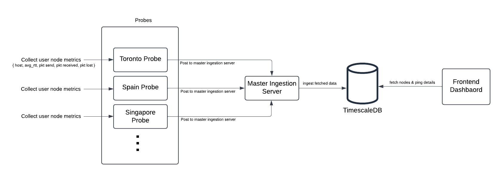

# IC Node Monitor

A comprehensive monitoring solution for IC (Internet Computer) nodes, featuring a distributed architecture with metric collection, ingestion, and visualization capabilities.

## Architecture



The system consists of three main components:
- **Master Ingestion Server**: Central server that receives and processes metrics
- **Metric Probe**: Lightweight agent that collects metrics from nodes
- **Frontend Dashboard**: Web interface for monitoring and visualization

## Quick Start

### Prerequisites

- Python 3.8+
- Node.js 16+
- PostgreSQL with TimescaleDB extension

Note: TimescaleDB is required for materialized views to function properly. The materialized views are specifically written for TimescaleDB. Refer to scripts/sql_commands.txt for database setup commands.

### 1. Master Ingestion Server

The master ingestion server acts as the central hub for collecting metrics from distributed probes.

```bash
# Navigate to the metric collector directory
cd metric_collector

# Install Python dependencies
pip install -r requirements.txt

# Configure environment variables (see Configuration section)
cp .env.example .env
# Edit .env with your configuration

# Start the server
uvicorn server:app --reload --host 0.0.0.0 --port 8000
```

The server will be available at `http://localhost:8000`

### 2. Metric Probe

The metric probe collects metrics from individual nodes.

```bash
# Navigate to the metric probe directory
cd metric_probe

# Install Python dependencies
pip install -r requirements.txt

# Configure environment variables (see Configuration section)
cp .env.example .env
# Edit .env with your configuration

# Start the probe
python3 probe.py
```

### 3. Frontend Dashboard

The web dashboard provides real-time monitoring and historical data visualization.

```bash
# Navigate to the frontend directory
cd frontend

# Install Node.js dependencies
npm install

# Configure environment variables
cp .env.example .env
# Edit .env with your configuration

# Start the development server
npm run dev
```

The dashboard will be available at `http://localhost:3000`

## Configuration

### Environment Variables

Each component requires specific environment variables for proper configuration:

- **Master Ingestion Server**: Copy `metric_collector/.env.example` to `metric_collector/.env`
- **Metric Probe**: Copy `metric_probe/.env.example` to `metric_probe/.env`  
- **Frontend**: Copy `frontend/.env.example` to `frontend/.env`

Key configuration points:
- Ensure `JWT_SECRET_KEY` and `ALGORITHM` are identical between the ingestion server and metric probe
- Set `ENVIRONMENT` to `"dev"` for development or `"prod"` for production deployment
- Configure database connection parameters according to your setup
- Set `MASTER_INGESTION_URL` in the probe configuration to point to your ingestion server

### Database Setup

The system requires a database for storing metrics and configuration. Refer to the database-related environment variables in the `.env.example` files for connection details.

## Production Deployment

For production deployment:

1. Set `ENVIRONMENT="prod"` or `ENV="prod"` in all relevant `.env` files
2. For deployments of ingestion server and probes, pm2 is suggested. Some other process manager will also work.

## Development

### Running in Development Mode

- Set `ENVIRONMENT="dev"` or `ENV="dev"` in all relevant `.env` files
